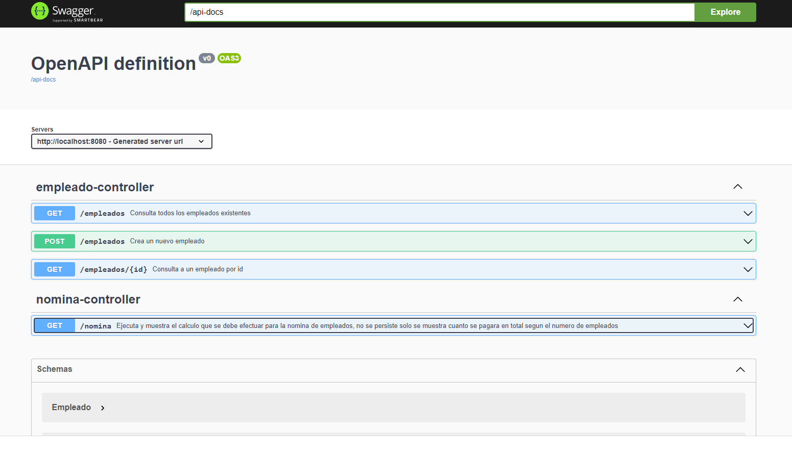

# Empleados-api
***
Api registrar empleados con su sueldo
## General Info
***
Para poder ejecutar el programa se requiere java 7 o superior, ejecutar mvn -X -e clean install para poder compilar el proyecto, una vez compilado
se puede ejecutar el comando mvn spring-boot:run o ejecutar estas instrucciones desde el ide de su preferencia, **es importante instalar el plugin de Lombok en el ide de su preferencia si se desea evitar errores o advertencias en el codigo:**
[Como instalar?](https://projectlombok.org/setup/intellij)
### Base de datos
La coneccion se realiza mediante mongodb para el aprovisionamiento de las entidades o documentos, no es necesario crear la base de datos previamente solo se necesita una instancia de este manejador y permitir conexiones por el puerto 27017
### Documentacion
Se disponibiliza de documentacion swagger con los endpoints para poder ejecutar todas las operaciones solicitadas [Empleado-api-doc](http://localhost:8080/swagger-ui/index.html#/)

